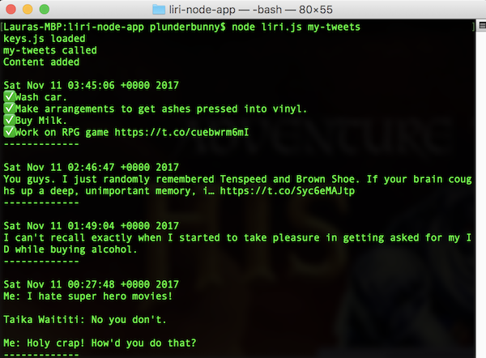
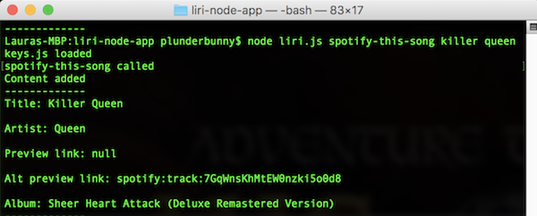

<h1 align="center">LIRI Node App</h1>

Meet LIRI: A command line node app that takes in parameters and gives you back data.

## Contents

- [Concept](#concept)
- [Technologies Used](#technologies-used)
- [Key Features](#key-features)
- [Screenshots](#screenshots)
  - [`my-tweets` command called](#my-tweets-command-called)
  - [`spotify-this-song` command called with "killer queen" search value](#spotify-this-song-command-called-with-killer-queen-search-value)
  - [`movie-this` command called](#movie-this-command-called)
  - [`do-what-it-says` command called](#do-what-it-says-command-called)

## Concept

A command-line application that processes custom commands to retrieve various data.

## Technologies Used

Node.js, `node-spotify`, `request`, and `twitter` NPM packages, APIs for Twitter, Spotify, & OMDB

### Key Features

* `my-tweets` command: Returns all tweets for default user account
* `spotify-this-song` command: Returns data for song title entered
* `movie-this` command: Returns data for movie title entered
* `do-what-it-says` command: Reads a text file and executes command contained in file

### Screenshots

###### `my-tweets` command called

###### `spotify-this-song` command called with "killer queen" search value

###### `movie-this` command called

###### `do-what-it-says` command called

